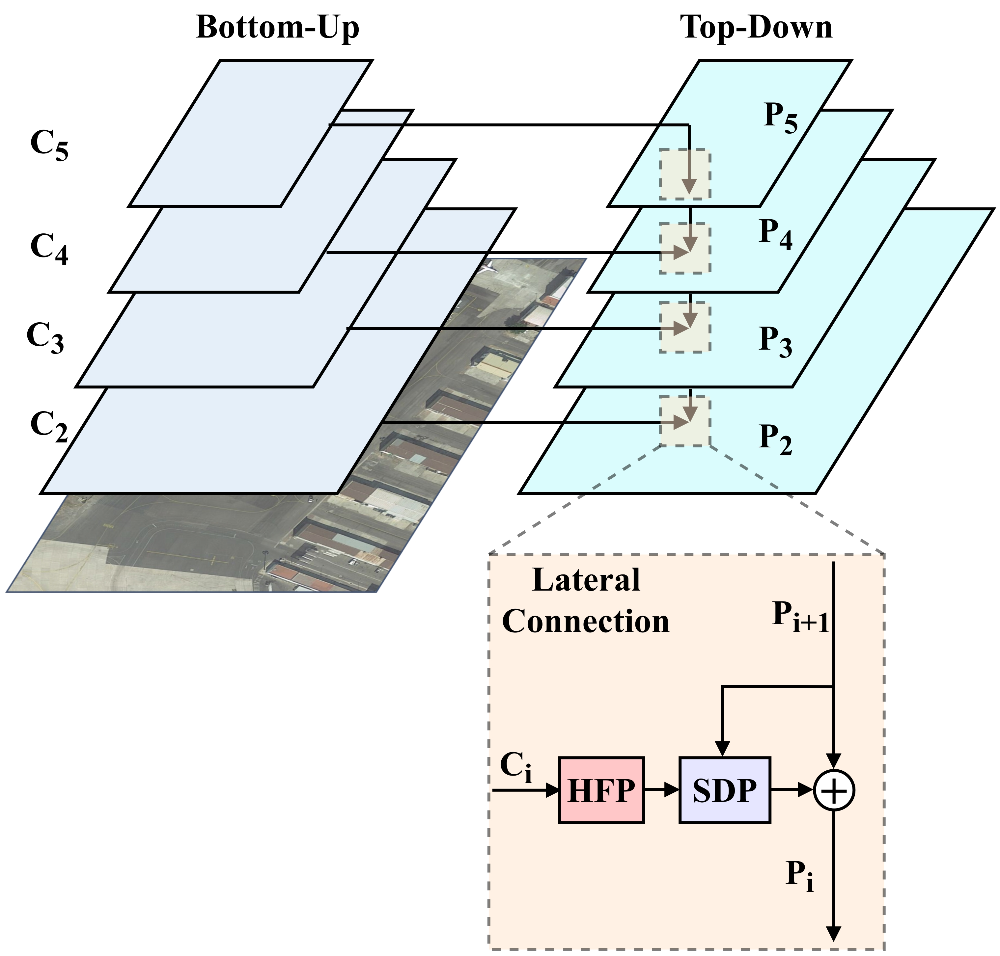

# HS-FPN[](https://arxiv.org/abs/2412.10116)

This is the official implementation of the AAAI2025 paper **HS-FPN: High Frequency and Spatial Perception FPN for Tiny Object Detection**.

<br>

## Introduction
`Abstract:` The introduction of Feature Pyramid Network (FPN) has significantly
improved object detection performance. However,
substantial challenges remain in detecting tiny objects, as
their features occupy only a very small proportion of the feature
maps. Although FPN integrates multi-scale features, it
does not directly enhance or enrich the features of tiny objects.
Furthermore, FPN lacks spatial perception ability. To
address these issues, we propose a novel High Frequency and
Spatial Perception Feature Pyramid Network (HS-FPN) with
two innovative modules. First, we designed a high frequency
perception module (HFP) that generates high frequency responses
through high pass filters. These high frequency responses
are used as mask weights from both spatial and channel
perspectives to enrich and highlight the features of tiny
objects in the original feature maps. Second, we developed
a spatial dependency perception module (SDP) to capture
the spatial dependencies that FPN lacks. Our experiments
demonstrate that detectors based on HS-FPN exhibit competitive
advantages over state-of-the-art models on the AI-TOD
dataset for tiny object detection.

- **HS-FPN**


- **HFP (High Frequency Perception Module)**  


- **SDP (Spatial Dependency Perception Module)**  


- **Result on AI-TOD**  


<br>

## Requirement
Required environments:
* Linux
* Python 3.7.16
* PyTorch 1.7.1
* CUDA 11.0
* torch_dct 0.1.6
* [MMdetection 2.24.1](https://github.com/open-mmlab/mmdetection/tree/v2.24.1)
* [cocoapi-aitod](https://github.com/jwwangchn/cocoapi-aitod)
* [`hsrequirement.txt`](hsfpn_requirements.txt)

> Note: The [`hsrequirement.txt`](hsfpn_requirements.txt) file contains all packages from the original development environment. HS-FPN may only require a subset of these packages to run properly.

<br>

##  Installation

### Step 1: Install MMDetection
HS-FPN is built upon [MMDetection v2.24.1](https://github.com/open-mmlab/mmdetection/tree/v2.24.1). Make sure MMDetection is properly installed following its [official instructions](https://github.com/open-mmlab/mmdetection/blob/v2.24.1/docs/zh_cn/get_started.md) before proceeding.

---

### Step 2: Integrate HS-FPN into MMDetection

Once MMDetection is installed, follow the steps below to integrate HS-FPN:
1. **Copy [`hs_fpn.py`](hs_fpn.py)** into the MMDetection `mmdet/models/necks` directory:
2. Edit `__init__.py` to register the HS-FPN module:
```python
from .hs_fpn import HS_FPN
```
Make sure the `__all__` list of `__init__.py` includes "HS_FPN".


<br>

## Train HS-FPN
Train a network with with single GPU, for example, Cascade R-CNN w/ HS-FPN:
```bash
python tools/train.py config_hsfpn\cascade_rcnn_r50_aitod.py
```
<br>

## Others
For related code of [RFLA: Gaussian Receptive Field based Label Assignment for Tiny Object Detection](https://arxiv.org/abs/2208.08738) and [NWD:A Normalized Gaussian Wasserstein Distance for Tiny Object Detection](https://arxiv.org/abs/2110.13389), please refer to their official repositories:

[RFLA Official Repository](https://github.com/Chasel-Tsui/mmdet-rfla)

[NWD Official Repository](https://github.com/jwwangchn/NWD)


## Citations
If you find this work helpful, please consider citing:
```bibtex
@inproceedings{shi2025hs,
  title={HS-FPN: High frequency and spatial perception FPN for tiny object detection},
  author={Shi, Zican and Hu, Jing and Ren, Jie and Ye, Hengkang and Yuan, Xuyang and Ouyang, Yan and He, Jia and Ji, Bo and Guo, Junyu},
  booktitle={Proceedings of the AAAI Conference on Artificial Intelligence},
  volume={39},
  number={7},
  pages={6896--6904},
  year={2025}
}
```