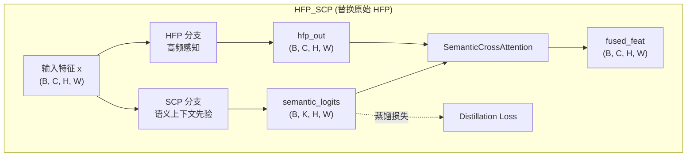
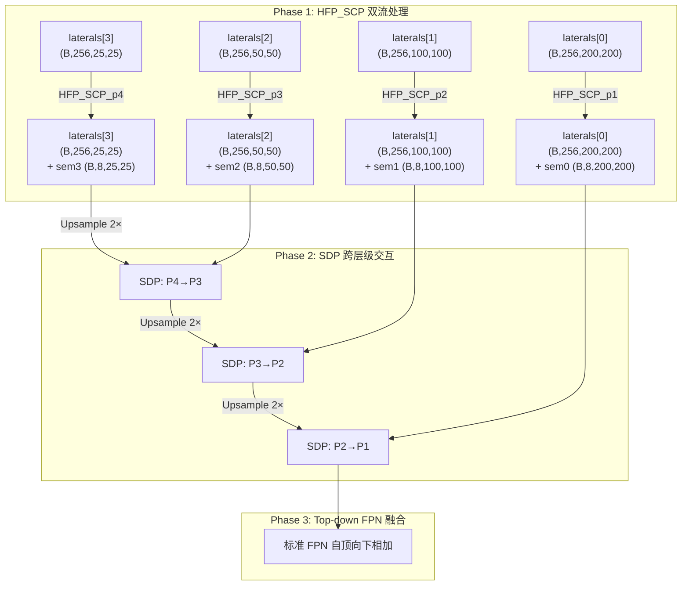
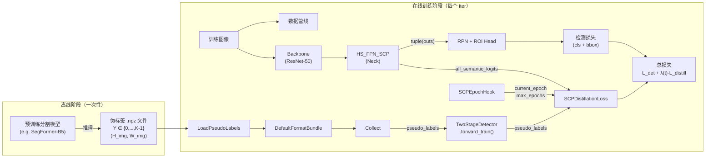
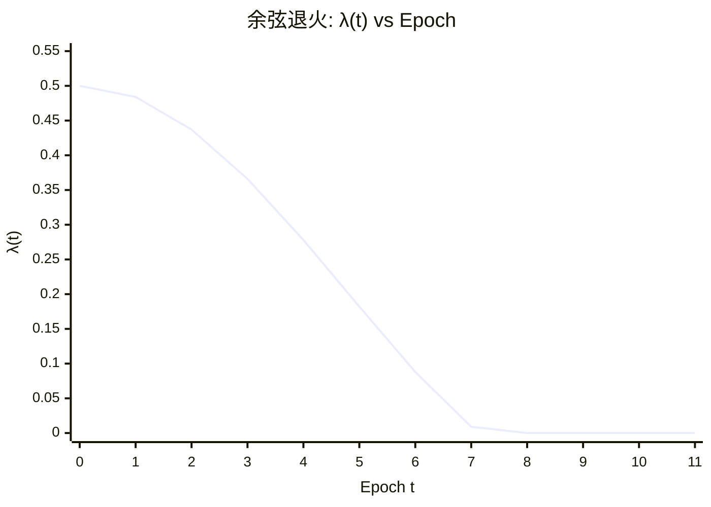

# SCP (Semantic Context Prior) 分支架构详解

> 本文档详细分析 `hs_fpn_scp.py` 中 SCP 分支的完整数据流、每一步的张量维度变换和数学公式。

---

## 1. 符号定义

| 符号 | 含义 | 默认值 |
|------|------|--------|
| $B$ | Batch size | 1 |
| $C$ | FPN 通道数 (out_channels) | 256 |
| $K$ | 语义类别数 (num_classes) | 8 |
| $d$ | Cross Attention 隐层维度 (attn_dim) | 64 |
| $H_i, W_i$ | 第 $i$ 层特征图的空间尺寸 | — |
| $r$ | DCT 低频保留比例 (ratio) | (0.25, 0.25) |
| $p_h, p_w$ | Patch 尺寸 (patch_size) | 随层级变化 |

---

## 2. 整体架构总览



**核心思想**：SCP 分支从输入特征中提取**低频/背景语义信息**，生成 $K$ 类语义图，通过 Cross Attention 将语义上下文注入 HFP 的高频感知特征中。训练期间，语义图额外参与蒸馏损失（由伪标签监督）。

---

## 3. 模块 1：LowFreqExtractor (LFE) — DCT 版本

> 用于 P1 & P2 层（分辨率足够高，适合 DCT）

### 3.1 数据流

```
输入: x ∈ ℝ^(B, C, H, W)
  │
  ├─ ① float()                        → x_float ∈ ℝ^(B, C, H, W)     [FP32]
  ├─ ② DCT.dct_2d(x_float)            → X ∈ ℝ^(B, C, H, W)           [频域]
  ├─ ③ 构建低通掩码 M                   → M ∈ ℝ^(1, 1, H, W) → expand → (B, C, H, W)
  ├─ ④ DCT.idct_2d(X ⊙ M)            → x_low ∈ ℝ^(B, C, H, W)       [空域低频]
  ├─ ⑤ clamp + dtype cast              → x_low ∈ ℝ^(B, C, H, W)
  ├─ ⑥ LayerNorm(x_low)                → x_low ∈ ℝ^(B, C, H, W)
  └─ ⑦ Conv1×1: C → C//4               → z ∈ ℝ^(B, C//4, H, W)
输出: z ∈ ℝ^(B, 64, H, W)
```

### 3.2 数学公式

**Step ②** — 2D 离散余弦变换（正交归一化）：

$$
X[u, v] = \alpha(u) \alpha(v) \sum_{i=0}^{H-1} \sum_{j=0}^{W-1} x[i, j] \cos\frac{(2i+1)u\pi}{2H} \cos\frac{(2j+1)v\pi}{2W}
$$

其中 $\alpha(0) = \sqrt{1/N}$, $\alpha(k) = \sqrt{2/N}$ for $k > 0$。

**Step ③** — 低通掩码构建：

$$
M[u, v] = \begin{cases}
1 & \text{if } u < \lfloor r_h \cdot H \rfloor \text{ and } v < \lfloor r_w \cdot W \rfloor \\
0 & \text{otherwise}
\end{cases}
$$

默认 $r = (0.25, 0.25)$，即保留频域左上角 $25\% \times 25\%$ 的低频分量。

**Step ④** — 逆 DCT + 低通滤波：

$$
x_{\text{low}} = \text{IDCT}(X \odot M)
$$

**Step ⑦** — 通道压缩：

$$
z = W_{\text{compress}} \ast x_{\text{low}}, \quad W_{\text{compress}} \in \mathbb{R}^{(C/4) \times C \times 1 \times 1}
$$

> [!NOTE]
> 与 HFP 中的 DctSpatialInteraction 相反——HFP **去掉**低频、**保留**高频（$M$ 中低频区域填 0），而 LFE **保留**低频、**去掉**高频（$M$ 中低频区域填 1）。两者是互补的频域分解。

---

## 4. 模块 1b：LowFreqExtractor_NoDCT (LFE) — Pool 版本

> 用于 P3 & P4 层（分辨率太低，DCT 效果不佳）

### 4.1 数据流

```
输入: x ∈ ℝ^(B, C, H, W)
  │
  ├─ ① AdaptiveAvgPool2d((8, 8))       → z ∈ ℝ^(B, C, 8, 8)
  ├─ ② bilinear interpolate → (H, W)   → z ∈ ℝ^(B, C, H, W)
  └─ ③ Conv1×1: C → C//4               → z ∈ ℝ^(B, C//4, H, W)
输出: z ∈ ℝ^(B, 64, H, W)
```

### 4.2 数学公式

$$
z = W_{\text{compress}} \ast \text{Upsample}\!\Big(\text{AvgPool}_{8 \times 8}(x)\Big)
$$

平均池化天然是低通滤波器，将空间信息压缩到 $8 \times 8$ 再上采样回原始尺寸，等效于提取全局低频结构。

---

## 5. 模块 2：LightweightSemanticHead (LSH)

### 5.1 网络结构

```
输入: z ∈ ℝ^(B, C//4, H, W)       // 即 (B, 64, H, W)
  │
  ├─ DWConv 3×3 (groups=64)         → (B, 64, H, W)
  ├─ PWConv 1×1                      → (B, 64, H, W)
  ├─ GroupNorm(16) + ReLU            → (B, 64, H, W)
  ├─ DWConv 3×3 (groups=64)         → (B, 64, H, W)
  ├─ PWConv 1×1                      → (B, 64, H, W)
  ├─ GroupNorm(16) + ReLU            → (B, 64, H, W)
  └─ Conv 1×1: C//4 → K             → (B, K, H, W)
输出: logits ∈ ℝ^(B, 8, H, W)
```

### 5.2 数学公式

两层深度可分离卷积 + 分类器：

$$
\hat{z}_1 = \text{ReLU}\!\Big(\text{GN}\!\big(\text{PW}(\text{DW}(z))\big)\Big)
$$

$$
\hat{z}_2 = \text{ReLU}\!\Big(\text{GN}\!\big(\text{PW}(\text{DW}(\hat{z}_1))\big)\Big)
$$

$$
\text{logits} = W_{\text{cls}} \ast \hat{z}_2, \quad W_{\text{cls}} \in \mathbb{R}^{K \times (C/4) \times 1 \times 1}
$$

> [!TIP]
> 使用深度可分离卷积而非标准卷积是为了保持轻量化。标准 $3 \times 3$ Conv 的参数量为 $C^2 \times 9$，而 DW+PW 仅为 $C \times 9 + C^2$，减少约 $9\times$。

---

## 6. 模块 3：SCP — 完整的语义上下文先验分支

### 6.1 数据流

SCP 是 LFE + LSH 的串联：

```
输入: x ∈ ℝ^(B, C, H, W)        // C=256
  │
  ├─ LFE(x)                       → z ∈ ℝ^(B, C//4, H, W)     // (B, 64, H, W)
  └─ LSH(z)                       → logits ∈ ℝ^(B, K, H, W)   // (B, 8, H, W)
输出: semantic_logits ∈ ℝ^(B, 8, H, W)
```

### 6.2 数学公式

$$
\text{SCP}(x) = \text{LSH}\!\Big(\text{LFE}(x)\Big) \in \mathbb{R}^{B \times K \times H \times W}
$$

| 阶段 | 输入维度 | 输出维度 | 操作 |
|------|---------|---------|------|
| LFE | $(B, 256, H, W)$ | $(B, 64, H, W)$ | DCT 低通 + LayerNorm + 1×1 压缩 |
| LSH | $(B, 64, H, W)$ | $(B, 8, H, W)$ | 2 × (DW+PW+GN+ReLU) + 1×1 分类 |

---

## 7. 模块 4：SemanticCrossAttention

> Q ← HFP 特征 $(C \text{ channels})$，K/V ← SCP 语义图 $(K \text{ channels})$

### 7.1 完整数据流（逐步维度标注）

以 P4 层为例：$H=25, W=25, p_h=p_w=25$（整张图做一个 patch）

```
输入:
  hfp_feat ∈ ℝ^(B, C, H, W)       = (1, 256, 25, 25)
  scp_feat ∈ ℝ^(B, K, H, W)       = (1, 8, 25, 25)
  patch_size = [p_h, p_w]           = [25, 25]

Step 1 — 线性投影:
  Q = conv_q(hfp_feat)              = (B, d, H, W)     = (1, 64, 25, 25)
  K = conv_k(scp_feat)              = (B, d, H, W)     = (1, 64, 25, 25)
  V = conv_v(scp_feat)              = (B, d, H, W)     = (1, 64, 25, 25)

Step 2 — Patchify (einops rearrange):
  设 n_h = H/p_h, n_w = W/p_w, N_p = p_h × p_w

  Q: (B, d, H, W) → (B·n_h·n_w, N_p, d)              = (1, 625, 64)
  K: (B, d, H, W) → (B·n_h·n_w, d, N_p)              = (1, 64, 625)
  V: (B, d, H, W) → (B·n_h·n_w, N_p, d)              = (1, 625, 64)

Step 3 — Scaled Dot-Product Attention:
  attn = softmax(Q × K / √d)       = (B', N_p, N_p)   = (1, 625, 625)

Step 4 — 加权聚合:
  out = attn × V                    = (B', N_p, d)     = (1, 625, 64)

Step 5 — 还原空间形状:
  out: (B', N_p, d) → transpose → (B', d, N_p)
     → rearrange → (B, d, H, W)                        = (1, 64, 25, 25)

Step 6 — 输出投影 + 残差:
  result = hfp_feat + out_proj(out) = (B, C, H, W)     = (1, 256, 25, 25)
```

### 7.2 数学公式

**投影**：

$$
Q = \text{GN}\!\big(W_Q \ast F_{\text{HFP}}\big) \in \mathbb{R}^{B \times d \times H \times W}, \quad W_Q \in \mathbb{R}^{d \times C \times 1 \times 1}
$$

$$
K = \text{GN}\!\big(W_K \ast S_{\text{SCP}}\big) \in \mathbb{R}^{B \times d \times H \times W}, \quad W_K \in \mathbb{R}^{d \times K \times 1 \times 1}
$$

$$
V = \text{GN}\!\big(W_V \ast S_{\text{SCP}}\big) \in \mathbb{R}^{B \times d \times H \times W}, \quad W_V \in \mathbb{R}^{d \times K \times 1 \times 1}
$$

**Patchify**（将空间维展平为 token 序列）：

$$
\tilde{Q} \in \mathbb{R}^{B' \times N_p \times d}, \quad
\tilde{K} \in \mathbb{R}^{B' \times d \times N_p}, \quad
\tilde{V} \in \mathbb{R}^{B' \times N_p \times d}
$$

其中 $B' = B \cdot \frac{H}{p_h} \cdot \frac{W}{p_w}$，$N_p = p_h \times p_w$。

**Attention 计算**：

$$
A = \text{Softmax}\!\left(\frac{\tilde{Q} \cdot \tilde{K}}{\sqrt{d}}\right) \in \mathbb{R}^{B' \times N_p \times N_p}
$$

$$
O = A \cdot \tilde{V} \in \mathbb{R}^{B' \times N_p \times d}
$$

**还原 + 残差**：

$$
\hat{O} = \text{Unpatchify}(O) \in \mathbb{R}^{B \times d \times H \times W}
$$

$$
\text{Output} = F_{\text{HFP}} + W_{\text{out}} \ast \hat{O}, \quad W_{\text{out}} \in \mathbb{R}^{C \times d \times 1 \times 1}
$$

> [!IMPORTANT]
> **注意 Q 和 K/V 的来源不同**：Q 来自 HFP（高频特征，$C=256$ 通道），K/V 来自 SCP（语义图，$K=8$ 通道）。这意味着每个空间位置的高频特征会去"查询"语义上下文，让检测特征感知到 "这里是什么类别的背景"。

---

## 8. 模块 5：HFP_SCP — 双流并行融合

### 8.1 数据流

```
输入: x ∈ ℝ^(B, C, H, W), patch_size = [p_h, p_w]
  │
  ├─ HFP(x)                           → hfp_out ∈ ℝ^(B, C, H, W)
  ├─ SCP(x)                           → semantic_logits ∈ ℝ^(B, K, H, W)
  └─ CrossAttn(hfp_out, sem_logits)   → fused ∈ ℝ^(B, C, H, W)
  
输出: (fused, semantic_logits)
       ℝ^(B,C,H,W)  ℝ^(B,K,H,W)
```

### 8.2 数学公式

$$
F_{\text{HFP}} = \text{HFP}(x) \in \mathbb{R}^{B \times C \times H \times W}
$$

$$
S_{\text{SCP}} = \text{SCP}(x) \in \mathbb{R}^{B \times K \times H \times W}
$$

$$
F_{\text{fused}} = \text{CrossAttn}(F_{\text{HFP}},\; S_{\text{SCP}},\; [p_h, p_w]) \in \mathbb{R}^{B \times C \times H \times W}
$$

---

## 9. 在 HS_FPN_SCP 中的完整调用流程

以 800×800 输入图像、ResNet-50 backbone 为例：

### 9.1 各层特征图尺寸

| 层级 | Backbone 输出 | Lateral 后 | patch_size | $N_p$ | isdct |
|------|-------------|-----------|------------|-------|-------|
| P1 (C2) | $(B, 256, 200, 200)$ | $(B, 256, 200, 200)$ | $[25, 25]$ | 625 | ✅ DCT |
| P2 (C3) | $(B, 512, 100, 100)$ | $(B, 256, 100, 100)$ | $[25, 25]$ | 625 | ✅ DCT |
| P3 (C4) | $(B, 1024, 50, 50)$ | $(B, 256, 50, 50)$ | $[25, 25]$ | 625 | ❌ Pool |
| P4 (C5) | $(B, 2048, 25, 25)$ | $(B, 256, 25, 25)$ | $[25, 25]$ | 625 | ❌ Pool |

> [!NOTE]
> `patch_size` 在代码中固定传入 `[h, w]`（即 P4 的空间尺寸 = $[25, 25]$），对所有层级均相同。对于 P1 (200×200)，$B' = B \times 8 \times 8 = 64B$，每个 patch 含 $25 \times 25 = 625$ 个 token。

### 9.2 Forward 流程（自顶向下）



### 9.3 每个 HFP_SCP 内部的维度跟踪（以 P2 层为例）

| 步骤 | 操作 | 输入维度 | 输出维度 |
|------|------|---------|---------|
| 1 | `HFP(x)` | $(B, 256, 100, 100)$ | $(B, 256, 100, 100)$ |
| 2 | `LFE: DCT + lowpass + IDCT` | $(B, 256, 100, 100)$ | $(B, 256, 100, 100)$ |
| 3 | `LFE: LayerNorm` | $(B, 256, 100, 100)$ | $(B, 256, 100, 100)$ |
| 4 | `LFE: Conv1×1 压缩` | $(B, 256, 100, 100)$ | $(B, 64, 100, 100)$ |
| 5 | `LSH: 2×(DW+PW+GN+ReLU)` | $(B, 64, 100, 100)$ | $(B, 64, 100, 100)$ |
| 6 | `LSH: Conv1×1 分类` | $(B, 64, 100, 100)$ | $(B, 8, 100, 100)$ |
| 7 | `conv_q: C→d` | $(B, 256, 100, 100)$ | $(B, 64, 100, 100)$ |
| 8 | `conv_k: K→d` | $(B, 8, 100, 100)$ | $(B, 64, 100, 100)$ |
| 9 | `conv_v: K→d` | $(B, 8, 100, 100)$ | $(B, 64, 100, 100)$ |
| 10 | `Patchify Q` | $(B, 64, 100, 100)$ | $(16B, 625, 64)$ |
| 11 | `Patchify K` | $(B, 64, 100, 100)$ | $(16B, 64, 625)$ |
| 12 | `Patchify V` | $(B, 64, 100, 100)$ | $(16B, 625, 64)$ |
| 13 | `Q·K / √d` | $(16B, 625, 64) \times (16B, 64, 625)$ | $(16B, 625, 625)$ |
| 14 | `Softmax` | $(16B, 625, 625)$ | $(16B, 625, 625)$ |
| 15 | `attn·V` | $(16B, 625, 625) \times (16B, 625, 64)$ | $(16B, 625, 64)$ |
| 16 | `Unpatchify` | $(16B, 625, 64)$ | $(B, 64, 100, 100)$ |
| 17 | `out_proj: d→C` | $(B, 64, 100, 100)$ | $(B, 256, 100, 100)$ |
| 18 | `残差相加` | $(B, 256, 100, 100) + (B, 256, 100, 100)$ | $(B, 256, 100, 100)$ |

> 其中 $n_h = 100/25 = 4$, $n_w = 100/25 = 4$, 所以 $B' = B \times 4 \times 4 = 16B$

---

## 10. 训练 vs 推理的输出差异

```python
# 训练时
return tuple(outs), all_semantic_logits
#       ↑ 5个尺度的检测特征     ↑ 4个尺度的语义图 [(B,8,25,25), (B,8,50,50), ...]

# 推理时
return tuple(outs)
#       ↑ 仅返回检测特征，SCP 分支的语义图不使用
```

> [!IMPORTANT]
> `all_semantic_logits` 在训练时被 `SCPEpochHook` 和蒸馏损失使用。推理时 SCP 分支仍然参与前向传播（通过 CrossAttention 影响检测特征），但不单独输出语义图。

---

## 11. 与 HFP 的对比：SCP 引入了什么

| 对比维度 | 原始 HFP | HFP_SCP |
|---------|---------|---------|
| 输入 | $(B, C, H, W)$ | $(B, C, H, W)$ |
| 输出 | $(B, C, H, W)$ | $(B, C, H, W)$ + $(B, K, H, W)$ |
| 频域利用 | **仅高频** | 高频 (HFP) + **低频** (LFE) |
| 语义信息 | 无 | $K$ 类语义分割图 |
| 融合方式 | 无 | Cross Attention (Q←高频, KV←语义) |
| 额外参数 | 0 | LFE + LSH + CrossAttn ≈ 轻量 |
| 训练监督 | 仅检测损失 | 检测损失 + 蒸馏损失 (伪标签) |

---

## 12. 知识蒸馏全流程详解

### 12.1 新增符号定义

| 符号 | 含义 | 默认值 |
|------|------|--------|
| $T$ | 总训练轮数 (total_epochs) | 12 |
| $t$ | 当前轮数 (current_epoch, 0-indexed) | — |
| $\lambda_{\max}$ | 蒸馏损失最大权重 (loss_weight_max) | 0.5 |
| $\lambda(t)$ | 第 $t$ 轮的蒸馏权重（余弦退火） | — |
| $L$ | FPN 层级数 | 4 |
| $H_{\text{img}}, W_{\text{img}}$ | 原始图像尺寸 | 800 × 800 |
| $Y$ | 伪标签 (pseudo-label) | — |
| $\hat{S}_l$ | 第 $l$ 层 SCP 输出的语义 logits | — |

---

### 12.2 整体蒸馏架构总览



---

### 12.3 阶段 1：伪标签生成（离线）

使用预训练的语义分割模型（如 SegFormer-B5）对每张训练图像进行推理，生成 $K$ 类粗粒度语义分割图。

**输入**：训练图像 $I \in \mathbb{R}^{3 \times H_{\text{img}} \times W_{\text{img}}}$

**输出**：伪标签 $Y \in \{0, 1, \ldots, K-1\}^{H_{\text{img}} \times W_{\text{img}}}$

存储格式：每张图像对应一个 `.npz` 文件，存于 `pseudo_labels/trainval/` 目录：

```
pseudo_labels/trainval/
├── image_001.npz      # np.savez(path, label=Y)
├── image_002.npz
└── ...
```

> [!NOTE]
> 伪标签中使用 `255` 表示"忽略区域"（如分割模型不确定的像素），在后续 CrossEntropyLoss 中通过 `ignore_index=255` 自动跳过。

---

### 12.4 阶段 2：数据管线加载伪标签

#### 12.4.1 LoadPseudoLabels

**源文件**：[load_pseudo_labels.py](file:///e:/HS-FPN-main/mmdetection/mmdet/datasets/pipelines/load_pseudo_labels.py)

```
输入: results dict (含 'ori_filename' 或 'filename')
  │
  ├─ ① 提取图像 basename                 → e.g. "image_001"
  ├─ ② 构建 .npz 路径                    → "pseudo_labels/trainval/image_001.npz"
  ├─ ③ np.load(npz_path)['label']        → Y ∈ np.int64^(H_img, W_img)
  │   （若文件不存在 → 全 255 的 fallback）
  └─ ④ results['pseudo_labels'] = Y
  
输出: results dict，新增 'pseudo_labels' key
```

**维度**：

$$
Y_{\text{raw}} \in \mathbb{Z}^{H_{\text{img}} \times W_{\text{img}}}, \quad Y_{\text{raw}}[i,j] \in \{0, 1, \ldots, K-1, 255\}
$$

#### 12.4.2 DefaultFormatBundle 中的打包

**源文件**：[formatting.py:L246-250](file:///e:/HS-FPN-main/mmdetection/mmdet/datasets/pipelines/formatting.py#L246-L250)

```python
# pseudo_labels: (H, W) → unsqueeze → (1, H, W) → to_tensor → DataContainer
results['pseudo_labels'] = DC(
    to_tensor(results['pseudo_labels'][None, ...].copy()),
    padding_value=255, stack=True)
```

**维度变换**：

$$
Y: \mathbb{Z}^{H \times W} \xrightarrow{\text{[None, ...]}} \mathbb{Z}^{1 \times H \times W} \xrightarrow{\text{to\_tensor}} \text{Tensor}^{1 \times H \times W}
$$

> 经 DataLoader collate 后：$Y_{\text{batch}} \in \mathbb{Z}^{B \times 1 \times H_{\text{pad}} \times W_{\text{pad}}}$，`padding_value=255` 确保 padding 区域被忽略。

#### 12.4.3 Collect

配置中指定收集 `pseudo_labels`：

```python
dict(type='Collect', keys=['img', 'gt_bboxes', 'gt_labels', 'pseudo_labels'])
```

`pseudo_labels` 作为 `**kwargs` 传入 `forward_train()`。

---

### 12.5 阶段 3：SCPEpochHook — 注入轮次信息

**源文件**：[scp_epoch_hook.py](file:///e:/HS-FPN-main/mmdetection/mmdet/core/hook/scp_epoch_hook.py)

```python
@HOOKS.register_module()
class SCPEpochHook(Hook):
    def before_train_epoch(self, runner):
        model = runner.model
        if hasattr(model, 'module'):       # 处理 DDP 包装
            model = model.module
        model.current_epoch = runner.epoch  # 0-indexed
        model.max_epochs = runner.max_epochs
```

**作用**：每个 epoch 开始前，将 `current_epoch` 和 `max_epochs` 注入到 detector 模型属性中，使得 `forward_train()` 可以获取 $t$ 和 $T$ 用于余弦退火计算。

**调用时序**：

```
Epoch 0 开始 → SCPEpochHook.before_train_epoch()
             → model.current_epoch = 0
             → model.max_epochs = 12
             → 训练一个 epoch 的所有 iter ...
Epoch 1 开始 → SCPEpochHook.before_train_epoch()
             → model.current_epoch = 1
             ...
```

---

### 12.6 阶段 4：TwoStageDetector.forward_train() 中的蒸馏集成

**源文件**：[two_stage.py:L104-195](file:///e:/HS-FPN-main/mmdetection/mmdet/models/detectors/two_stage.py#L104-L195)

#### 12.6.1 extract_feat() — 解包 Neck 输出

```python
def extract_feat(self, img):
    x = self.backbone(img)            # 4个尺度的特征图
    neck_out = self.neck(x)
    if isinstance(neck_out, tuple) and len(neck_out) == 2 \
            and isinstance(neck_out[1], list):
        x, semantic_logits = neck_out  # 训练模式：解包
        return x, semantic_logits
    return x                           # 推理模式：直接返回
```

**维度**：

$$
x = \big(\underbrace{P_1}_{(B,256,200,200)},\; \underbrace{P_2}_{(B,256,100,100)},\; \underbrace{P_3}_{(B,256,50,50)},\; \underbrace{P_4}_{(B,256,25,25)},\; \underbrace{P_5}_{(B,256,13,13)}\big)
$$

$$
\text{semantic\_logits} = \big[\underbrace{\hat{S}_4}_{(B,8,25,25)},\; \underbrace{\hat{S}_3}_{(B,8,50,50)},\; \underbrace{\hat{S}_2}_{(B,8,100,100)},\; \underbrace{\hat{S}_1}_{(B,8,200,200)}\big]
$$

> [!NOTE]
> `semantic_logits` 列表中的顺序是 **P4 → P3 → P2 → P1**（自顶向下），因为 HS_FPN_SCP 的 forward 中先处理 P4、再处理 P3 ...

#### 12.6.2 forward_train() — 蒸馏损失计算

```python
def forward_train(self, img, img_metas, gt_bboxes, gt_labels, **kwargs):
    x = self.extract_feat(img)
    
    # ① 解包 semantic_logits
    semantic_logits = None
    if isinstance(x, tuple) and len(x) == 2 and isinstance(x[1], list):
        x, semantic_logits = x

    losses = dict()

    # ② 计算 SCP 蒸馏损失
    if semantic_logits is not None and 'pseudo_labels' in kwargs:
        pseudo_labels = kwargs.pop('pseudo_labels')   # (B, 1, H, W)
        if pseudo_labels.dim() == 4:
            pseudo_labels = pseudo_labels.squeeze(1)   # → (B, H, W)

        current_epoch = getattr(self, 'current_epoch', 0)
        total_epochs = getattr(self, 'max_epochs', 12)

        scp_loss_fn = SCPDistillationLoss(
            num_classes=8, loss_weight_max=0.5, ignore_index=255)
        loss_distill = scp_loss_fn(
            semantic_logits, pseudo_labels,
            current_epoch, total_epochs)
        losses['loss_scp_distill'] = loss_distill

    # ③ 正常的 RPN + ROI 检测损失
    ...
    return losses
```

**维度跟踪**：

| 步骤 | 变量 | 维度 |
|------|------|------|
| kwargs 中取出 | `pseudo_labels` | $(B, 1, H_{\text{pad}}, W_{\text{pad}})$ |
| squeeze(1) | `pseudo_labels` | $(B, H_{\text{pad}}, W_{\text{pad}})$ |
| 传入 loss_fn | `semantic_logits` | list of 4 × $(B, 8, H_l, W_l)$ |
| 传入 loss_fn | `pseudo_labels` | $(B, H_{\text{pad}}, W_{\text{pad}})$ |

---

### 12.7 阶段 5：SCPDistillationLoss — 蒸馏损失计算

**源文件**：[scp_distill_loss.py](file:///e:/HS-FPN-main/mmdetection/mmdet/models/losses/scp_distill_loss.py)

#### 12.7.1 完整数据流

```
输入:
  semantic_logits_list:  [Ŝ₄, Ŝ₃, Ŝ₂, Ŝ₁]        各层 SCP 输出
  pseudo_labels:         Y ∈ ℤ^(B, H_pad, W_pad)    伪标签
  current_epoch:         t                            当前轮次
  total_epochs:          T                            总轮次

  │
  ├─ ① 计算余弦退火权重 λ(t)
  │
  ├─ ② 若 λ < 1e-8 → 返回 0（跳过计算）
  │
  ├─ ③ 对每个层级 l ∈ {4, 3, 2, 1}:
  │   ├─ 取 Ŝ_l ∈ ℝ^(B, K, H_l, W_l)
  │   ├─ 将 Y resize 到 (H_l, W_l):
  │   │     Y: (B, H_pad, W_pad) → unsqueeze(1) → (B, 1, H_pad, W_pad)
  │   │     → float() → nearest interpolate → (B, 1, H_l, W_l)
  │   │     → long() → squeeze(1) → Y_l ∈ ℤ^(B, H_l, W_l)
  │   └─ CE_l = CrossEntropyLoss(Ŝ_l, Y_l, ignore_index=255)
  │
  └─ ④ 输出: L_distill = λ(t) × (1/L) × Σ CE_l

输出: L_distill (标量)
```

#### 12.7.2 逐层级维度跟踪（以 800×800 图像为例）

| 层级 $l$ | $\hat{S}_l$ 维度 | $Y$ 原始维度 | resize 后 $Y_l$ 维度 | CE 损失 |
|----------|------------------|-------------|---------------------|---------|
| P4 | $(B, 8, 25, 25)$ | $(B, 800, 800)$ | $(B, 25, 25)$ | 标量 |
| P3 | $(B, 8, 50, 50)$ | $(B, 800, 800)$ | $(B, 50, 50)$ | 标量 |
| P2 | $(B, 8, 100, 100)$ | $(B, 800, 800)$ | $(B, 100, 100)$ | 标量 |
| P1 | $(B, 8, 200, 200)$ | $(B, 800, 800)$ | $(B, 200, 200)$ | 标量 |

#### 12.7.3 伪标签 resize 的数学描述

对于层级 $l$，空间尺寸为 $(H_l, W_l)$：

$$
Y_l = \text{Nearest}\!\Big(Y,\; \text{target\_size}=(H_l, W_l)\Big) \in \{0, \ldots, K\!-\!1, 255\}^{B \times H_l \times W_l}
$$

> [!IMPORTANT]
> 使用 **nearest** 插值而非 bilinear，因为伪标签是**离散类别标签**（整数），双线性插值会产生无意义的中间值。

#### 12.7.4 逐层级交叉熵损失

对于层级 $l$，SCP 预测为 $\hat{S}_l \in \mathbb{R}^{B \times K \times H_l \times W_l}$，目标为 $Y_l \in \mathbb{Z}^{B \times H_l \times W_l}$：

$$
\text{CE}_l = -\frac{1}{|\mathcal{V}_l|} \sum_{(b,i,j) \in \mathcal{V}_l} \log \frac{\exp\!\big(\hat{S}_l[b, Y_l[b,i,j], i, j]\big)}{\displaystyle\sum_{k=0}^{K-1} \exp\!\big(\hat{S}_l[b, k, i, j]\big)}
$$

其中 $\mathcal{V}_l = \{(b, i, j) \mid Y_l[b, i, j] \neq 255\}$ 是**有效像素集合**（排除 ignore_index=255）。

#### 12.7.5 余弦退火权重

$$
\lambda(t) = \frac{\lambda_{\max}}{2} \left(1 + \cos\frac{\pi \cdot t}{T}\right)
$$

| epoch $t$ | $\lambda(t)$ (当 $\lambda_{\max}=0.5$, $T=12$) |
|-----------|------|
| 0 | 0.500 |
| 1 | 0.484 |
| 2 | 0.437 |
| 3 | 0.366 |
| 4 | 0.278 |
| 5 | 0.182 |
| 6 | 0.088 |
| 7 | 0.009 |
| 8 | ≈ 0.0 |
| ... | ≈ 0.0 |
| 11 | ≈ 0.0 |



> [!TIP]
> **设计意图**：训练前期（epoch 0~4），蒸馏损失权重 $\lambda(t)$ 较大，SCP 分支在伪标签的强监督下快速学会背景语义分割；训练后期（epoch 5+），$\lambda(t) \to 0$，让检测梯度占主导，避免蒸馏信号（可能含噪）干扰最终检测性能。

#### 12.7.6 最终蒸馏损失

$$
\mathcal{L}_{\text{distill}} = \lambda(t) \cdot \frac{1}{L} \sum_{l=1}^{L} \text{CE}_l
$$

其中 $L = 4$（P1~P4 共 4 个层级）。

---

### 12.8 阶段 6：总损失组成

在 `forward_train()` 中，最终返回的 `losses` 字典包含：

$$
\mathcal{L}_{\text{total}} = \underbrace{\mathcal{L}_{\text{rpn\_cls}} + \mathcal{L}_{\text{rpn\_bbox}}}_{\text{RPN 损失}} + \underbrace{\sum_{s=1}^{3} w_s \Big(\mathcal{L}_{\text{rcnn\_cls}}^{(s)} + \mathcal{L}_{\text{rcnn\_bbox}}^{(s)}\Big)}_{\text{Cascade R-CNN 3 阶段损失}} + \underbrace{\mathcal{L}_{\text{distill}}}_{\text{SCP 蒸馏损失}}
$$

其中 Cascade R-CNN 阶段权重 $w_1=1, w_2=0.5, w_3=0.25$。

| 损失项 | 键名 | 来源 | 权重 |
|--------|------|------|------|
| RPN 分类 | `loss_rpn_cls` | RPNHead | 1.0 |
| RPN 回归 | `loss_rpn_bbox` | RPNHead | 1.0 |
| RCNN 分类 ×3 | `s0.loss_cls`, `s1.loss_cls`, `s2.loss_cls` | CascadeRoIHead | 1.0, 0.5, 0.25 |
| RCNN 回归 ×3 | `s0.loss_bbox`, `s1.loss_bbox`, `s2.loss_bbox` | CascadeRoIHead | 1.0, 0.5, 0.25 |
| **SCP 蒸馏** | **`loss_scp_distill`** | **SCPDistillationLoss** | **$\lambda(t)$ 余弦退火** |

---

### 12.9 端到端数据流总结

以一个训练 iter 为完整示例（$B=1$, 800×800 图像, epoch $t=2$）：

```
┌─────────────────────────────────────────────────────────────────────────────┐
│ 数据管线                                                                     │
├─────────────────────────────────────────────────────────────────────────────┤
│ LoadImageFromFile     → img: np.uint8^(800,800,3)                          │
│ LoadAnnotations       → gt_bboxes, gt_labels                               │
│ LoadPseudoLabels      → pseudo_labels: np.int64^(800,800)                  │
│ Resize(800,800)       → (无变化)                                            │
│ RandomFlip            → (可能翻转)                                          │
│ Normalize             → img: np.float32^(800,800,3)                        │
│ Pad(divisor=32)       → img: np.float32^(800,800,3)                        │
│ DefaultFormatBundle   → img: Tensor(3,800,800)                             │
│                       → pseudo_labels: Tensor(1,800,800) [DC, stack=True]  │
│ Collect               → data dict with keys: img, gt_bboxes, gt_labels,   │
│                         pseudo_labels                                       │
└─────────────────────────────────────────────────────────────────────────────┘
                                    │
                                    ▼
┌─────────────────────────────────────────────────────────────────────────────┐
│ TwoStageDetector.forward_train()                                           │
├─────────────────────────────────────────────────────────────────────────────┤
│ img: (1, 3, 800, 800)                                                      │
│                                                                             │
│ ① Backbone (ResNet-50):                                                    │
│    C2: (1, 256, 200, 200)                                                  │
│    C3: (1, 512, 100, 100)                                                  │
│    C4: (1, 1024, 50, 50)                                                   │
│    C5: (1, 2048, 25, 25)                                                   │
│                                                                             │
│ ② HS_FPN_SCP Neck:                                                        │
│    features:   P1~P5, 各 (1, 256, H_l, W_l)                               │
│    sem_logits: [Ŝ₄(1,8,25,25), Ŝ₃(1,8,50,50),                           │
│                 Ŝ₂(1,8,100,100), Ŝ₁(1,8,200,200)]                       │
│                                                                             │
│ ③ 解包 pseudo_labels:                                                      │
│    (1, 1, 800, 800) → squeeze → Y: (1, 800, 800)                         │
│                                                                             │
│ ④ SCPDistillationLoss:                                                     │
│    λ(2) = 0.5/2 × (1 + cos(2π/12)) = 0.437                               │
│    CE_P4: Ŝ₄(1,8,25,25) vs Y→(1,25,25)     → 标量                       │
│    CE_P3: Ŝ₃(1,8,50,50) vs Y→(1,50,50)     → 标量                       │
│    CE_P2: Ŝ₂(1,8,100,100) vs Y→(1,100,100) → 标量                       │
│    CE_P1: Ŝ₁(1,8,200,200) vs Y→(1,200,200) → 标量                       │
│    L_distill = 0.437 × (CE_P4+CE_P3+CE_P2+CE_P1) / 4                     │
│                                                                             │
│ ⑤ RPN + Cascade ROI Head → L_det                                          │
│                                                                             │
│ ⑥ losses = {                                                               │
│       'loss_scp_distill': L_distill,                                       │
│       'loss_rpn_cls': ...,   'loss_rpn_bbox': ...,                         │
│       's0.loss_cls': ...,    's0.loss_bbox': ...,                           │
│       's1.loss_cls': ...,    's1.loss_bbox': ...,                           │
│       's2.loss_cls': ...,    's2.loss_bbox': ...,                           │
│    }                                                                        │
└─────────────────────────────────────────────────────────────────────────────┘
```

---

### 12.10 两阶段训练策略总结

```mermaid
gantt
    title SCP 两阶段训练策略
    dateFormat X
    axisFormat %s

    section 阶段一 (强蒸馏)
    λ(t) 从 0.5 衰减到 ~0.09    :a1, 0, 7

    section 阶段二 (检测主导)
    λ(t) ≈ 0, 纯检测梯度         :a2, 7, 12
```



| 阶段 | Epoch 范围 | $\lambda(t)$ 范围 | 主要梯度来源 | 目标 |
|------|-----------|-------------------|-------------|------|
| **阶段一** | 0 ~ 6 | 0.50 → 0.09 | 蒸馏 + 检测 | SCP 学习背景语义，语义图通过 CrossAttn 调制 HFP 特征 |
| **阶段二** | 7 ~ 11 | ≈ 0 | 纯检测 | SCP 参数冻结（梯度极小），CrossAttn 融合的特征被检测任务微调 |

> [!IMPORTANT]
> **推理时 SCP 仍然参与前向传播**。虽然训练后期蒸馏损失为 0，但 SCP 分支的参数已在阶段一学到了有用的语义表示。推理时 SCP 产生的语义图仍然通过 CrossAttention 影响检测特征，提供场景上下文信息以增强微小目标检测。
