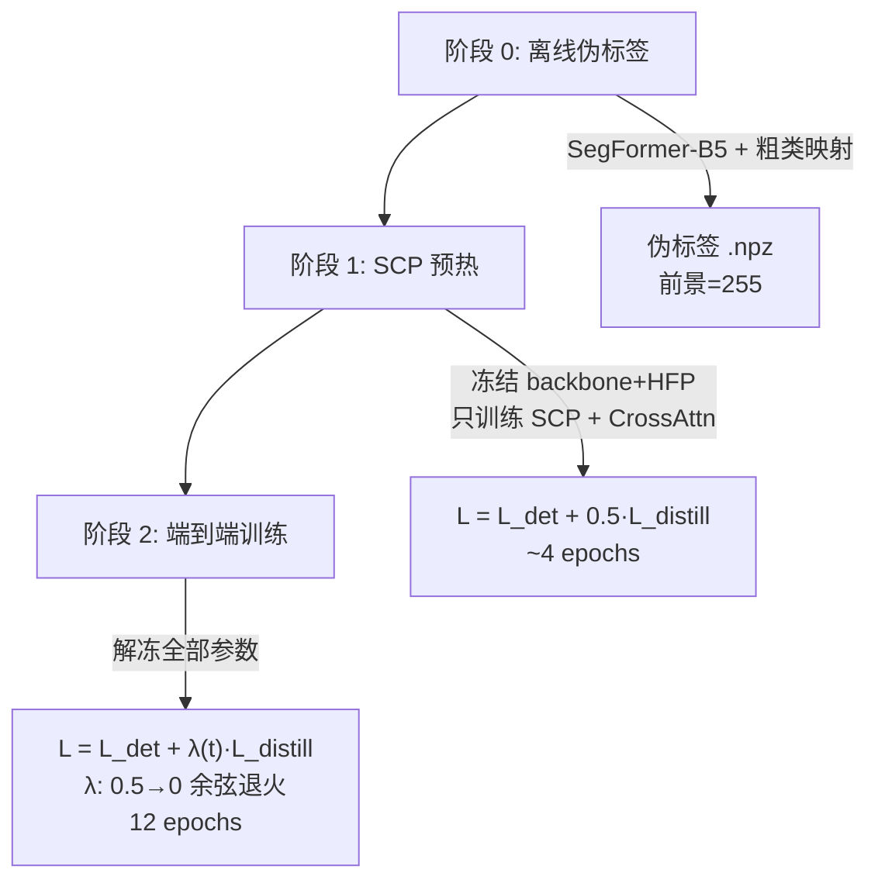

# SCP 分支设计方案 (v3.0 — Cross Attention 融合)

## 1. 核心思想

> [!IMPORTANT]
> **HFP（高频感知）** 利用 DCT 高通滤波提取边缘/纹理 → 突出"目标长什么样"
> **SCP（语义上下文先验）** 利用低频信息做粗分割 → 告诉网络"目标可能出现在哪里"
>
> 两者互补。HFP 输出 $\mathbf{F}_{\text{hfp}} \in \mathbb{R}^{B \times C \times H \times W}$，
> SCP 输出 $\mathbf{S} \in \mathbb{R}^{B \times K \times H \times W}$ 的 K 类语义图，
> 通过 **Cross Attention** 让高频特征主动查询语义上下文，按注意力得分加权融合。

---

## 2. 整体架构

```
              Lateral Feature  x ∈ ℝ^{B×C×H×W}
                        │
              ┌─────────┴─────────┐
              │                   │
          ┌───▼───┐          ┌────▼────┐
          │  HFP  │          │   SCP   │
          │ 高频增强 │          │ 低频提取  │
          │       │          │    ↓    │
          │       │          │ 粗分割头  │ ← 蒸馏损失(训练时)
          └───┬───┘          └────┬────┘
              │                   │
        F_hfp ∈ ℝ^{B×C×H×W}    S ∈ ℝ^{B×K×H×W}
              │                   │
              └───────┬───────────┘
                      │
             ┌────────▼────────┐
             │ Cross Attention │
             │  Q ← F_hfp     │
             │  K,V ← S       │
             └────────┬────────┘
                      │
                F_out ∈ ℝ^{B×C×H×W}  → 送入 SDP
```

---

## 3. SCP 分支详细设计

### 3.1 低频特征提取器 (Low-Frequency Extractor, LFE)

#### 3.1.1 数学原理

对输入特征 $\mathbf{x} \in \mathbb{R}^{B \times C \times H \times W}$，2D DCT 将空间域变换到频率域：

$$\mathbf{X} = \text{DCT-2D}(\mathbf{x})$$

HFP 使用高通滤波掩码 $\mathbf{M}_{\text{high}}$ 保留高频，LFE 使用互补的低通滤波掩码 $\mathbf{M}_{\text{low}}$：

$$\mathbf{M}_{\text{low}}(u, v) = \begin{cases} 1 & \text{if } u < r_h \cdot H \text{ and } v < r_w \cdot W \\ 0 & \text{otherwise} \end{cases}$$

$$\mathbf{M}_{\text{high}}(u, v) = 1 - \mathbf{M}_{\text{low}}(u, v)$$

其中 $(r_h, r_w) = (0.25, 0.25)$ 为截止频率比例。低频特征通过 IDCT 反变换回空间域：

$$\mathbf{x}_{\text{low}} = \text{IDCT-2D}(\mathbf{X} \odot \mathbf{M}_{\text{low}})$$

最后通过 $1 \times 1$ 卷积压缩通道，降低后续计算量：

$$\mathbf{z} = \text{Conv}_{1\times1}(\mathbf{x}_{\text{low}}) \in \mathbb{R}^{B \times \frac{C}{4} \times H \times W}$$

> [!WARNING]
> **FP16 数值稳定性**：`torch-dct` 在 FP16 下容易产生 NaN。
> 在 IDCT 输出后必须加 `clamp` + `LayerNorm` 保护。

#### 3.1.2 代码实现

**P1 & P2 层级**（高分辨率，使用 DCT）：

```python
class LowFreqExtractor(BaseModule):
    def __init__(self, in_channels, ratio, init_cfg=...):
        super().__init__(init_cfg)
        self.ratio = ratio
        self.norm = nn.LayerNorm(in_channels)
        self.compress = ConvModule(in_channels, in_channels // 4, 1, bias=False)

    def forward(self, x):
        _, _, h, w = x.size()
        x_float = x.float()                                      # FP32 保护
        X = DCT.dct_2d(x_float, norm='ortho')                    # DCT 变换
        M = self._compute_low_pass_weight(h, w, self.ratio).to(x.device)
        M = M.view(1, h, w).expand_as(X)
        x_low = DCT.idct_2d(X * M, norm='ortho')                 # IDCT 反变换
        x_low = x_low.clamp(-1e4, 1e4).to(x.dtype)               # clamp 保护
        x_low = self.norm(x_low.permute(0,2,3,1)).permute(0,3,1,2)  # LayerNorm
        return self.compress(x_low)                                # C → C//4

    def _compute_low_pass_weight(self, h, w, ratio):
        h0, w0 = int(h * ratio[0]), int(w * ratio[1])
        weight = torch.zeros((h, w), requires_grad=False)
        weight[:h0, :w0] = 1                                     # 保留低频
        return weight
```

**P3 & P4 层级**（低分辨率，使用池化代替 DCT）：

```python
class LowFreqExtractor_NoDCT(BaseModule):
    def __init__(self, in_channels, init_cfg=...):
        super().__init__(init_cfg)
        self.pool = nn.AdaptiveAvgPool2d((8, 8))
        self.compress = ConvModule(in_channels, in_channels // 4, 1, bias=False)

    def forward(self, x):
        _, _, h, w = x.size()
        z = self.pool(x)
        z = F.interpolate(z, size=(h, w), mode='bilinear', align_corners=False)
        return self.compress(z)
```

---

### 3.2 轻量语义分割头 (Lightweight Semantic Head, LSH)

#### 3.2.1 数学描述

输入低频特征 $\mathbf{z} \in \mathbb{R}^{B \times \frac{C}{4} \times H \times W}$，经过两层深度可分离卷积 + 1×1 分类卷积，输出 K 类语义 logits：

$$\mathbf{S} = W_{\text{cls}} \ast \text{DWSConv}_2\big(\text{DWSConv}_1(\mathbf{z})\big) \in \mathbb{R}^{B \times K \times H \times W}$$

其中每层深度可分离卷积 (DWSConv) 展开为：

$$\text{DWSConv}(\mathbf{z}) = \text{ReLU}\Big(\text{GN}\big(\text{Conv}_{1\times1}(\text{DWConv}_{3\times3}(\mathbf{z}))\big)\Big)$$

- $\text{DWConv}_{3\times3}$：深度卷积（`groups=channels`），只做空间混合，参数量 $\frac{C}{4} \times 3 \times 3$
- $\text{Conv}_{1\times1}$：逐点卷积，做通道混合，参数量 $(\frac{C}{4})^2$
- $\text{GN}$：GroupNorm（16 组）
- $W_{\text{cls}}$：最终 $1\times1$ 卷积，$\frac{C}{4} \to K$，参数量 $\frac{C}{4} \times K$

#### 3.2.2 代码实现

```python
class LightweightSemanticHead(BaseModule):
    def __init__(self, in_channels, num_classes=8, init_cfg=...):
        super().__init__(init_cfg)
        ch = in_channels  # C//4
        self.head = nn.Sequential(
            nn.Conv2d(ch, ch, 3, padding=1, groups=ch, bias=False),  # DWConv
            nn.Conv2d(ch, ch, 1, bias=False),                        # Pointwise
            nn.GroupNorm(16, ch), nn.ReLU(inplace=True),
            nn.Conv2d(ch, ch, 3, padding=1, groups=ch, bias=False),  # DWConv
            nn.Conv2d(ch, ch, 1, bias=False),                        # Pointwise
            nn.GroupNorm(16, ch), nn.ReLU(inplace=True),
            nn.Conv2d(ch, num_classes, 1)                            # 分类头
        )

    def forward(self, z):
        return self.head(z)  # (B, K, H, W)
```

#### 3.2.3 K 类背景类别

针对 AI-TOD 航拍场景，建议 K=8：

| 粗类别 ID | 语义 | 典型目标关联 |
|:---------:|------|------------|
| 0 | 水域（海/河/湖/池） | 船舶 ↑↑↑，泳池 ↑↑ |
| 1 | 道路/停车场 | 车辆 ↑↑↑，行人 ↑↑ |
| 2 | 建筑密集区 | 行人 ↑↑，车辆 ↑ |
| 3 | 机场/跑道 | 飞机 ↑↑↑ |
| 4 | 桥梁结构 | 桥梁 ↑↑↑，车辆 ↑ |
| 5 | 农田/草地 | 风车 ↑↑ |
| 6 | 植被/林地 | 目标 ↓↓ |
| 7 | 其他背景 | — |

---

### 3.3 完整 SCP 模块

SCP 将 LFE 和 LSH 串联，输出 K 类语义图 $\mathbf{S}$：

$$\mathbf{z} = \text{LFE}(\mathbf{x}), \quad \mathbf{S} = \text{LSH}(\mathbf{z})$$

```python
class SCP(BaseModule):
    def __init__(self, in_channels, ratio, num_classes=8, isdct=True, init_cfg=...):
        super().__init__(init_cfg)
        compressed_ch = in_channels // 4
        if isdct:
            self.lfe = LowFreqExtractor(in_channels, ratio)
        else:
            self.lfe = LowFreqExtractor_NoDCT(in_channels)
        self.semantic_head = LightweightSemanticHead(compressed_ch, num_classes)

    def forward(self, x):
        z = self.lfe(x)                              # (B, C//4, H, W)
        semantic_logits = self.semantic_head(z)        # (B, K, H, W)
        return semantic_logits
```

---

## 4. Cross Attention 融合

### 4.1 设计动机

| 方案 | 问题 |
|------|------|
| 乘法门控 `HFP × (1+α·prior)` | prior 是单通道 (B,1,H,W) → 无法区分不同类别的目标 |
| 固定投影 K→256 | prior 是 (B,256,H,W) → 256 通道不对应类别，且权重与输入无关 |
| **Cross Attention** | **注意力权重依赖输入特征本身**，自动学习 K 类背景与特征的关联 |

### 4.2 数学推导

#### 4.2.1 输入

- $\mathbf{F} = \text{HFP}(\mathbf{x}) \in \mathbb{R}^{B \times C \times H \times W}$，高频增强特征
- $\mathbf{S} = \text{SCP}(\mathbf{x}) \in \mathbb{R}^{B \times K \times H \times W}$，K 类语义图

#### 4.2.2 投影到共同维度 d

由于 $C \neq K$（通常 $C=256, K=8$），无法直接计算注意力。通过三组可学习的投影矩阵将它们映射到共同维度 $d$：

$$\mathbf{Q} = \text{GN}\big(W_Q \ast \mathbf{F}\big) \in \mathbb{R}^{B \times d \times H \times W}, \quad W_Q \in \mathbb{R}^{d \times C \times 1 \times 1}$$

$$\mathbf{K} = \text{GN}\big(W_K \ast \mathbf{S}\big) \in \mathbb{R}^{B \times d \times H \times W}, \quad W_K \in \mathbb{R}^{d \times K \times 1 \times 1}$$

$$\mathbf{V} = \text{GN}\big(W_V \ast \mathbf{S}\big) \in \mathbb{R}^{B \times d \times H \times W}, \quad W_V \in \mathbb{R}^{d \times K \times 1 \times 1}$$

**含义**：
- $W_Q$ 将 C 维高频特征压缩为 d 维查询向量 —— **"我的高频特征需要什么样的语义补充？"**
- $W_K$ 将 K 维语义概率映射到 d 维键向量 —— **"当前位置的背景语义是什么？"**
- $W_V$ 将 K 维语义概率映射到 d 维值向量 —— **"这种背景能提供什么信息？"**

#### 4.2.3 Patch 化

为了控制计算量（避免 $O((HW)^2)$），将空间维度划分为不重叠的 patch（与已有 SDP 模块一致）：

设 patch 大小为 $(p_h, p_w)$，空间维度 $H \times W$ 被划分为 $\frac{H}{p_h} \times \frac{W}{p_w}$ 个 patch，每个 patch 包含 $N_p = p_h \times p_w$ 个空间位置。

$$\hat{\mathbf{Q}} = \text{rearrange}\Big(\mathbf{Q},\ B \times d \times (n_h \cdot p_h) \times (n_w \cdot p_w) \to (B \cdot n_h \cdot n_w) \times N_p \times d\Big)$$

$$\hat{\mathbf{K}} = \text{rearrange}\Big(\mathbf{K},\ \text{同上}\Big), \quad \hat{\mathbf{V}} = \text{rearrange}\Big(\mathbf{V},\ \text{同上}\Big)$$

其中 $n_h = H / p_h$，$n_w = W / p_w$，$B' = B \cdot n_h \cdot n_w$ 为展开后的 batch 维度。

#### 4.2.4 注意力计算

在每个 patch 内部，计算缩放的点积注意力：

$$\mathbf{A} = \text{softmax}\left(\frac{\hat{\mathbf{Q}} \cdot \hat{\mathbf{K}}^\top}{\sqrt{d}}\right) \in \mathbb{R}^{B' \times N_p \times N_p}$$

**含义**：$\mathbf{A}_{i,j}$ 表示 patch 内第 $i$ 个位置的高频特征对第 $j$ 个位置的语义信息的注意力权重。

$$\hat{\mathbf{O}} = \mathbf{A} \cdot \hat{\mathbf{V}} \in \mathbb{R}^{B' \times N_p \times d}$$

**含义**：每个位置根据注意力权重聚合周围位置的语义信息。如果位置 $i$ 的高频特征和位置 $j$ 的语义特征匹配（例如，$i$ 处存在船的高频边缘，$j$ 处标注为水域），注意力权重 $\mathbf{A}_{i,j}$ 就会很大，从而让 $i$ 获得更多水域语义信息加持。

#### 4.2.5 还原与投影

将 patch 还原为完整空间维度，并通过 $1\times1$ 卷积投影回 C 维特征空间：

$$\mathbf{O} = \text{rearrange}\Big(\hat{\mathbf{O}},\ (B \cdot n_h \cdot n_w) \times N_p \times d \to B \times d \times H \times W\Big)$$

$$\mathbf{F}_{\text{fused}} = \mathbf{F} + W_{\text{out}} \ast \mathbf{O}, \quad W_{\text{out}} \in \mathbb{R}^{C \times d \times 1 \times 1}$$

残差连接保证：**当 Cross Attention 层权重为零时，输出等于纯 HFP 特征，Baseline 安全退化。**

### 4.3 与 SDP 模块的对比

| | SDP（已有模块） | SemanticCrossAttention（新增） |
|---|---|---|
| **Q 来源** | 当前 FPN 层 $\mathbf{F}_{\ell}$ (C 维) | HFP 高频增强输出 $\mathbf{F}$ (C 维) |
| **K / V 来源** | 高一层上采样 $\uparrow\mathbf{F}_{\ell+1}$ (C 维) | SCP 语义图 $\mathbf{S}$ (K 维) |
| **投影 Q** | $C \to d$ | $C \to d$（相同） |
| **投影 K / V** | $C \to d$ | $K \to d$（维度不同，但结构相同） |
| **注意力计算** | 相同 | 相同 |
| **目的** | 跨尺度空间依赖 | 特征-语义上下文关联 |

**关键区别仅在于 K/V 投影层的输入通道从 C 变为 K，其余结构完全一致。**

### 4.4 代码实现

```python
class SemanticCrossAttention(BaseModule):
    """
    HFP 特征(C 通道)与 SCP 语义图(K 通道)之间的 Cross Attention。
    结构与 SDP 一致，仅 K/V 投影的输入维度从 C 改为 K。
    """
    def __init__(self, feat_channels=256, num_classes=8, attn_dim=64, init_cfg=...):
        super().__init__(init_cfg)
        self.attn_dim = attn_dim

        # Q 投影: C → d
        self.conv_q = nn.Sequential(
            ConvModule(feat_channels, attn_dim, 1, padding=0, bias=False),
            nn.GroupNorm(32, attn_dim)
        )
        # K 投影: K → d
        self.conv_k = nn.Sequential(
            ConvModule(num_classes, attn_dim, 1, padding=0, bias=False),
            nn.GroupNorm(32, attn_dim)
        )
        # V 投影: K → d
        self.conv_v = nn.Sequential(
            ConvModule(num_classes, attn_dim, 1, padding=0, bias=False),
            nn.GroupNorm(32, attn_dim)
        )
        # 输出投影: d → C
        self.out_proj = ConvModule(attn_dim, feat_channels, 1, padding=0, bias=False)
        self.softmax = nn.Softmax(dim=-1)

    def forward(self, hfp_feat, scp_feat, patch_size):
        """
        Args:
            hfp_feat:   (B, C, H, W)  HFP 输出
            scp_feat:   (B, K, H, W)  SCP K 类语义图
            patch_size:  [p_h, p_w]
        Returns:
            (B, C, H, W)  融合后特征
        """
        B, C, H, W = hfp_feat.shape
        ph, pw = patch_size

        # 投影
        Q = self.conv_q(hfp_feat)    # (B, d, H, W)
        K = self.conv_k(scp_feat)    # (B, d, H, W)
        V = self.conv_v(scp_feat)    # (B, d, H, W)

        # Patch 化: (B, d, H, W) → (B', N_p, d)
        Q = rearrange(Q, 'b d (h p1) (w p2) -> (b h w) (p1 p2) d',
                      p1=ph, p2=pw)
        K = rearrange(K, 'b d (h p1) (w p2) -> (b h w) d (p1 p2)',
                      p1=ph, p2=pw)
        V = rearrange(V, 'b d (h p1) (w p2) -> (b h w) (p1 p2) d',
                      p1=ph, p2=pw)

        # 注意力: (B', N_p, d) × (B', d, N_p) → (B', N_p, N_p)
        attn = torch.matmul(Q, K) / np.power(self.attn_dim, 0.5)
        attn = self.softmax(attn)

        # 加权聚合: (B', N_p, N_p) × (B', N_p, d) → (B', N_p, d)
        out = torch.matmul(attn, V)

        # 还原: (B', N_p, d) → (B, d, H, W)
        out = rearrange(out.transpose(1, 2).contiguous(),
                       '(b h w) d (p1 p2) -> b d (h p1) (w p2)',
                       p1=ph, p2=pw, h=H//ph, w=W//pw)

        # 投影回 C 维 + 残差
        return hfp_feat + self.out_proj(out)
```

---

## 5. HFP_SCP 融合模块（替换原始 HFP）

### 5.1 完整数据流公式

给定输入特征 $\mathbf{x} \in \mathbb{R}^{B \times C \times H \times W}$：

$$\mathbf{F}_{\text{hfp}} = \text{HFP}(\mathbf{x}) \in \mathbb{R}^{B \times C \times H \times W}$$

$$\mathbf{S} = \text{SCP}(\mathbf{x}) \in \mathbb{R}^{B \times K \times H \times W}$$

$$\mathbf{F}_{\text{out}} = \text{CrossAttn}(\mathbf{F}_{\text{hfp}},\ \mathbf{S},\ \text{patch\_size}) \in \mathbb{R}^{B \times C \times H \times W}$$

展开 CrossAttn 内部：

$$\mathbf{F}_{\text{out}} = \mathbf{F}_{\text{hfp}} + W_{\text{out}} \ast \text{rearrange}\left(\text{softmax}\left(\frac{\hat{\mathbf{Q}} \hat{\mathbf{K}}^\top}{\sqrt{d}}\right) \hat{\mathbf{V}}\right)$$

### 5.2 代码实现

```python
class HFP_SCP(BaseModule):
    """
    替换原始 HS-FPN 中的 HFP。
    HFP 和 SCP 并行处理，通过 Cross Attention 融合。
    """
    def __init__(self, in_channels, ratio, num_classes=8,
                 patch=(8,8), attn_dim=64, isdct=True, init_cfg=...):
        super().__init__(init_cfg)
        self.hfp = HFP(in_channels, ratio=ratio, patch=patch, isdct=isdct)
        self.scp = SCP(in_channels, ratio=ratio, num_classes=num_classes, isdct=isdct)
        self.cross_attn = SemanticCrossAttention(
            feat_channels=in_channels,
            num_classes=num_classes,
            attn_dim=attn_dim
        )

    def forward(self, x, patch_size):
        """
        Returns:
            fused_feat:      (B, C, H, W)
            semantic_logits: (B, K, H, W)  训练时用于蒸馏损失
        """
        hfp_out = self.hfp(x)                # (B, C, H, W)
        semantic_logits = self.scp(x)          # (B, K, H, W)

        # Cross Attention 融合:
        # HFP 特征查询 SCP 语义上下文，按注意力加权融合
        fused = self.cross_attn(hfp_out, semantic_logits, patch_size)

        return fused, semantic_logits
```

---

## 6. 在 HS-FPN 中的集成

原始 `HS_FPN.__init__` 中，将 `HFP` 替换为 `HFP_SCP`：

```python
# 原始
self.SelfAttn_p4 = HFP(out_channels, ratio=None, isdct=False)
# 替换为
self.SelfAttn_p4 = HFP_SCP(out_channels, ratio=None, num_classes=8,
                            patch=(8,8), attn_dim=64, isdct=False)
```

修改后的 `forward`：

```python
@auto_fp16()
def forward(self, inputs):
    laterals = [lateral_conv(inputs[i + self.start_level])
                for i, lateral_conv in enumerate(self.lateral_convs)]
    _, _, h, w = laterals[3].size()

    all_semantic_logits = []

    laterals[3], sem3 = self.SelfAttn_p4(laterals[3], [h, w])
    all_semantic_logits.append(sem3)

    laterals[2], sem2 = self.SelfAttn_p3(laterals[2], [h, w])
    laterals[2] = self.CrossAtten_p4_p3(laterals[2],
                      self.fpn_upsample(laterals[3]), [h, w])
    all_semantic_logits.append(sem2)

    laterals[1], sem1 = self.SelfAttn_p2(laterals[1], [h, w])
    laterals[1] = self.CrossAtten_p3_p2(laterals[1],
                      self.fpn_upsample(laterals[2]), [h, w])
    all_semantic_logits.append(sem1)

    laterals[0], sem0 = self.SelfAttn_p1(laterals[0], [h, w])
    laterals[0] = self.CrossAtten_p2_p1(laterals[0],
                      self.fpn_upsample(laterals[1]), [h, w])
    all_semantic_logits.append(sem0)

    # ... (后续 FPN top-down + 输出生成不变)

    if self.training:
        return tuple(outs), all_semantic_logits
    return tuple(outs)
```

---

## 7. 知识蒸馏训练

### 7.1 伪标签生成

使用 SegFormer-B5（ADE20K 预训练）离线生成伪标签：

$$\hat{\mathbf{Y}} = \text{Coarse}\Big(\text{SegFormer}(\mathbf{I})\Big) \in \{0, 1, \ldots, K{-}1, 255\}^{H \times W}$$

其中 $\text{Coarse}(\cdot)$ 将 ADE20K 的 150 类合并为 K=8 个粗背景类。

> [!CAUTION]
> **前景目标必须排除**：ADE20K 中的 person, car, truck, boat, airplane 等前景类
> 必须映射为 `ignore_index=255`，在损失中忽略。
> 否则会引起检测头与语义头的任务冲突。

```python
def map_ade20k_to_coarse(label):
    coarse = np.full_like(label, fill_value=255)  # 默认忽略
    water_ids  = [21, 26, 60, 109, 128]           # sea, river, lake, pool
    road_ids   = [6, 11, 52, 91]                   # road, sidewalk, runway
    build_ids  = [1, 25, 48, 79]                   # building, house, wall
    veg_ids    = [4, 9, 17, 66, 73]                # tree, grass, forest
    ground_ids = [13, 29, 46, 81]                  # earth, sand, soil
    for idx in water_ids:  coarse[label == idx] = 0
    for idx in road_ids:   coarse[label == idx] = 1
    for idx in build_ids:  coarse[label == idx] = 2
    for idx in veg_ids:    coarse[label == idx] = 3
    for idx in ground_ids: coarse[label == idx] = 4
    # person(12), car(20), truck(83), boat(76), airplane(90) → 255
    return coarse
```

### 7.2 蒸馏损失

#### 7.2.1 逐层交叉熵损失

对每个 FPN 层级 $\ell \in \{1, 2, 3, 4\}$，SCP 输出 $\mathbf{S}^{(\ell)} \in \mathbb{R}^{B \times K \times H_\ell \times W_\ell}$，伪标签下采样到对应分辨率：

$$\hat{\mathbf{Y}}^{(\ell)} = \text{Resize}_{\text{nearest}}(\hat{\mathbf{Y}},\; H_\ell,\; W_\ell)$$

交叉熵损失（忽略 index=255）：

$$\mathcal{L}_{\text{distill}}^{(\ell)} = -\frac{1}{|\Omega^{(\ell)}|} \sum_{(i,j) \in \Omega^{(\ell)}} \log \frac{\exp(\mathbf{S}^{(\ell)}_{y_{ij}, i, j})}{\sum_{k=1}^{K} \exp(\mathbf{S}^{(\ell)}_{k, i, j})}$$

其中 $\Omega^{(\ell)} = \{(i,j) \mid \hat{Y}^{(\ell)}_{i,j} \neq 255\}$ 为有效像素集合，$y_{ij} = \hat{Y}^{(\ell)}_{i,j}$ 为该像素的伪标签。

#### 7.2.2 多层级平均

$$\mathcal{L}_{\text{distill}} = \frac{1}{4} \sum_{\ell=1}^{4} \mathcal{L}_{\text{distill}}^{(\ell)}$$

#### 7.2.3 余弦退火权重

蒸馏损失权重 $\lambda(t)$ 随 epoch $t$ 余弦退火：

$$\lambda(t) = \frac{\lambda_{\max}}{2} \left(1 + \cos\frac{\pi \cdot t}{T}\right)$$

| epoch $t$ | $\lambda(t)$（$\lambda_{\max}=0.5, T=12$） | 含义 |
|:---------:|:---------:|------|
| 0 | 0.50 | 蒸馏全力引导 SCP 学习背景语义 |
| 4 | 0.25 | 蒸馏逐步减弱 |
| 8 | 0.07 | 检测损失开始主导 |
| 12 | 0.00 | 蒸馏完全退出，检测梯度接管 SCP |

**设计原因**：早期伪标签引导 SCP 快速收敛；后期伪标签的粗糙性会拖累精度，让检测损失反向微调 SCP 以达到特征级最优自洽。

### 7.3 总训练损失

$$\mathcal{L}_{\text{total}} = \mathcal{L}_{\text{det}} + \lambda(t) \cdot \mathcal{L}_{\text{distill}}$$

其中 $\mathcal{L}_{\text{det}}$ 为标准的 Cascade R-CNN 检测损失（RPN loss + ROI loss）。

### 7.4 蒸馏损失代码

```python
class SCPDistillationLoss(nn.Module):
    def __init__(self, num_classes=8, loss_weight_max=0.5):
        super().__init__()
        self.ce_loss = nn.CrossEntropyLoss(ignore_index=255)
        self.loss_weight_max = loss_weight_max

    def forward(self, semantic_logits_list, pseudo_labels,
                current_epoch, total_epochs):
        lam = self._cosine_annealing(current_epoch, total_epochs,
                                      self.loss_weight_max)
        total_loss = 0
        for sem_logits in semantic_logits_list:
            _, _, h, w = sem_logits.shape
            target = F.interpolate(pseudo_labels.float(),
                                   size=(h, w), mode='nearest'
                                   ).long().squeeze(1)
            total_loss += self.ce_loss(sem_logits, target)
        return lam * total_loss / len(semantic_logits_list)

    @staticmethod
    def _cosine_annealing(t, T, lam_max):
        return lam_max / 2.0 * (1 + math.cos(math.pi * t / T))
```

---

## 8. 训练流程



---

## 9. 参数量与计算开销

| 组件 | 参数量 ($C=256, K=8, d=64$) |
|------|-------------|
| LFE (低频提取 + LN) | $C^2/4 + 2C \approx 17\text{K}$ × 4 层 |
| LSH (2× DWSConv + cls) | $\approx 14\text{K}$ × 4 层 |
| CrossAttn ($W_Q, W_K, W_V, W_{\text{out}}$) | $Cd + 2Kd + dC \approx 34\text{K}$ × 4 层 |
| **SCP + CrossAttn 总计** | **~260K**（约为 HFP 的 30%） |

---

## 10. 关键设计决策总结

| 设计选择 | 决定 | 理由 |
|---------|------|------|
| 低频提取 | DCT 低通 (P1/P2), AvgPool (P3/P4) | 与 HFP 精确互补 |
| 分割输出维度 | K=8 类 (B,K,H,W) | 粗粒度背景区分 |
| **融合方式** | **Cross Attention (Q←HFP, KV←SCP)** | **注意力依赖输入，自动学习背景↔特征关联** |
| 注意力空间 | Patch 化 (与 SDP 相同) | 控制 $O(N_p^2)$ 计算量 |
| 输出连接 | 残差: $\mathbf{F} + W_{\text{out}} \ast \mathbf{O}$ | 权重为零时退化为纯 HFP |
| DCT 数值保护 | FP32 + clamp + LayerNorm | 防 FP16 NaN |
| 伪标签前景 | ignore_index=255 | 避免任务冲突 |
| 蒸馏权重 | 余弦退火 $\lambda_{\max} \to 0$ | 后期让检测梯度接管 |
